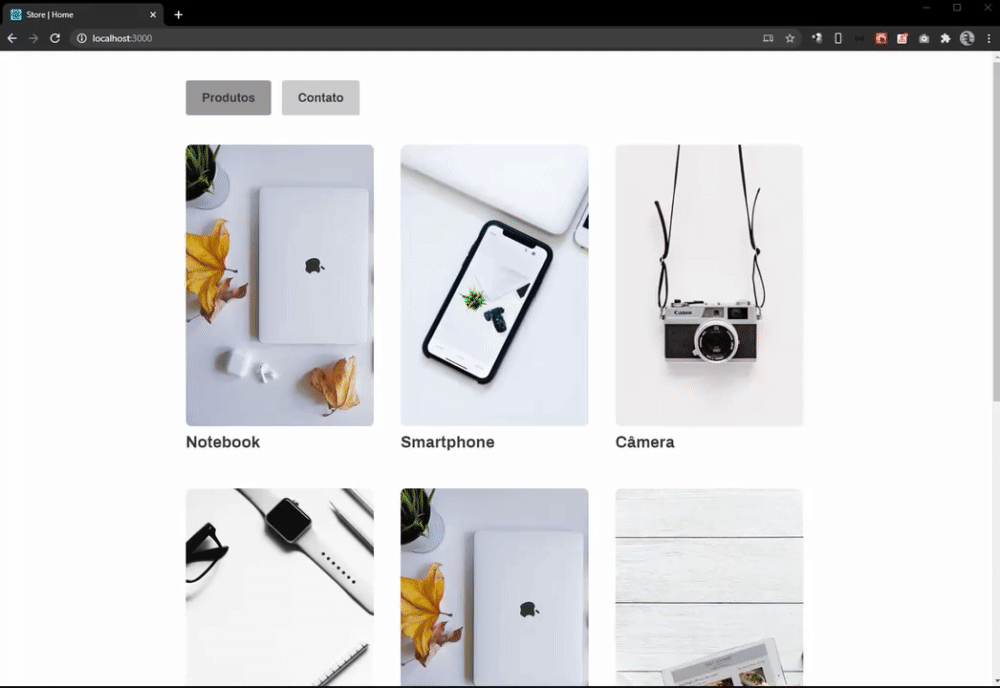
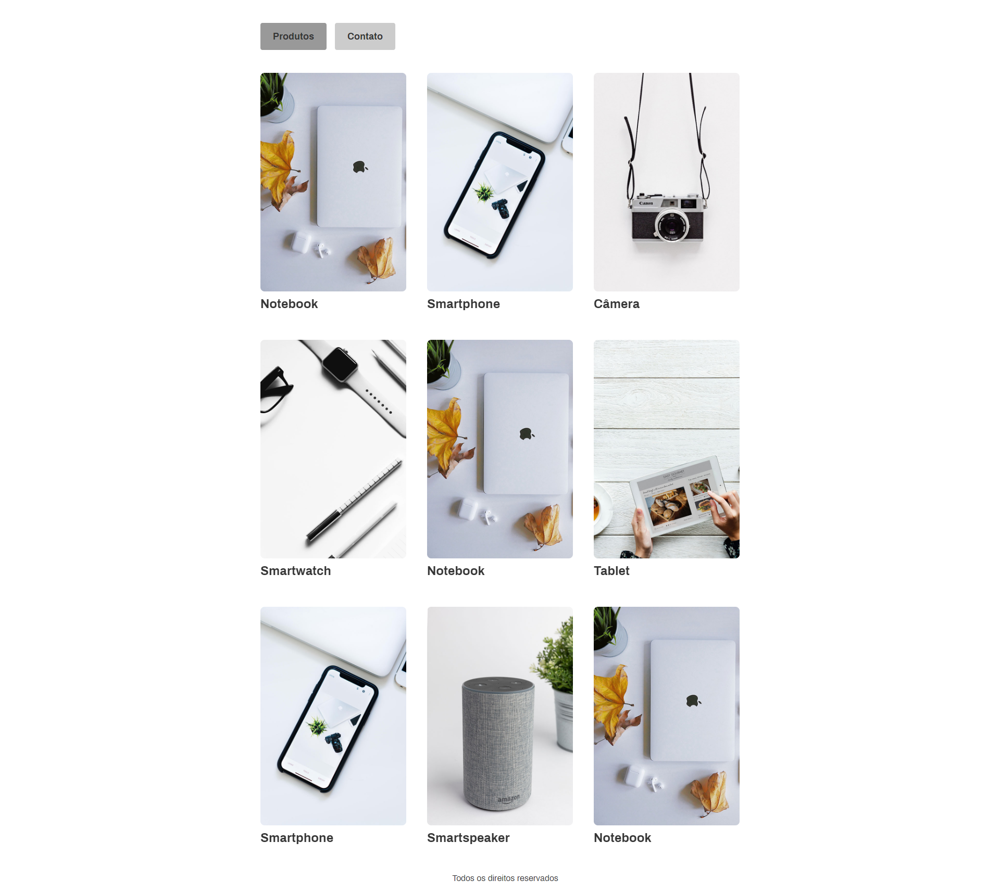
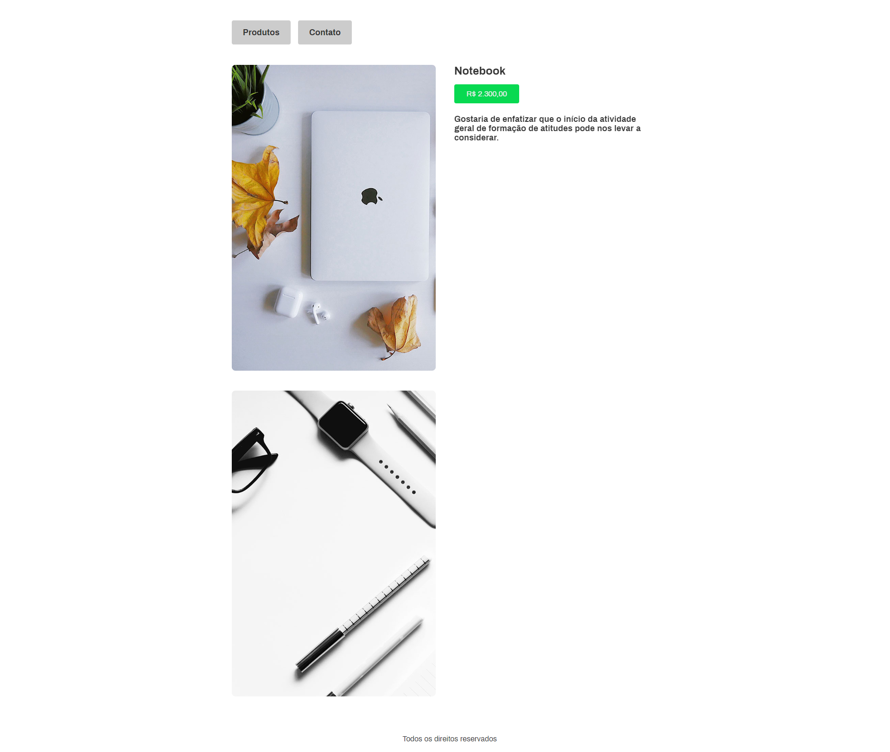
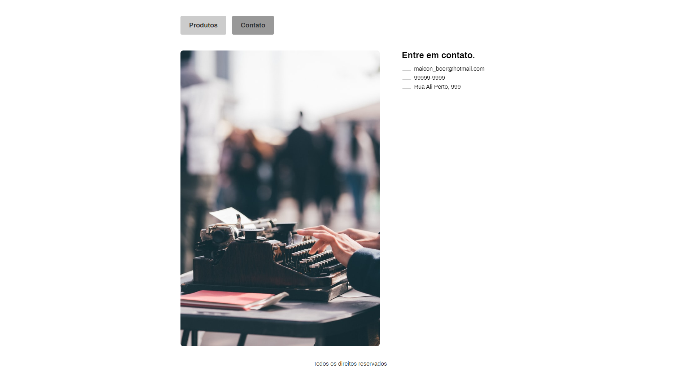

# store-reactjs
Praticando ReactJS 

- API
- Rotas
- Components
- useState
- useEffect
- useLocation
- Link
- NavLink
- Styled Components
- Animação (@Keyframes)

---------------------------------------------------

---------------------------------------------------

   

---------------------------------------------------

Faça um clone desse repositório rodando:  

        git clone https://github.com/maiconboer/covid19.git 

 ### 🔧 Para instalar as dependências do projeto:

    npm install 
    
ou

    yarn

------------------------------------------

 ###  🎉 Para startar:
    
    npm start
    
ou

    yarn start
